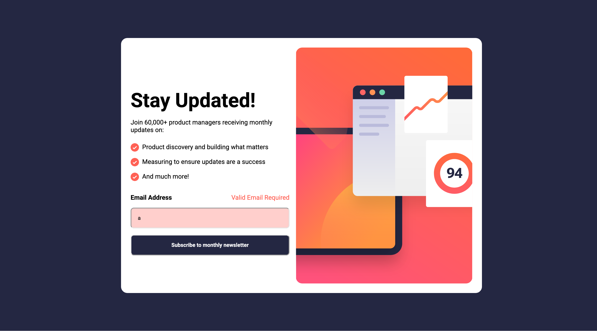

# 02-Newsletter-Signup-Form

Newsletter Signup Form with JavaScript

What I learned:

- First time using something with JavaScript on something that felt like a realistic application
- Used event listeners and window.location.href to change windows.
- Used chatGPT for the regex and function but understand how they work.
- First time needing more than one HTML and CSS page
- Used align self
- Changed background images using CSS not HTML at different viewports.
- Used forms for the first time in a while.

